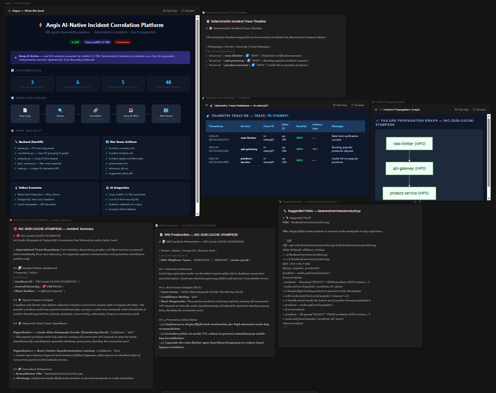
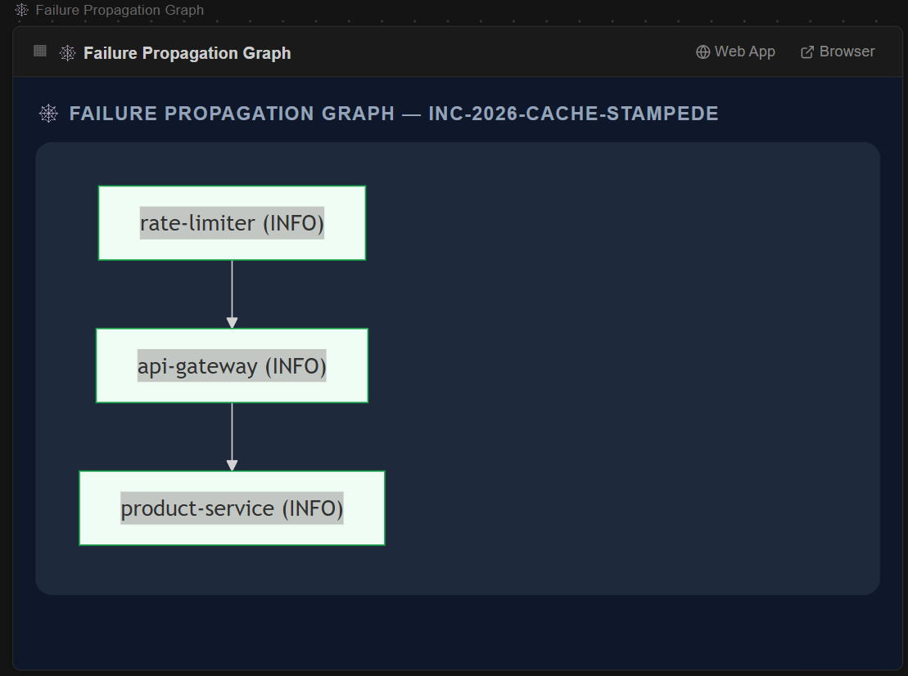
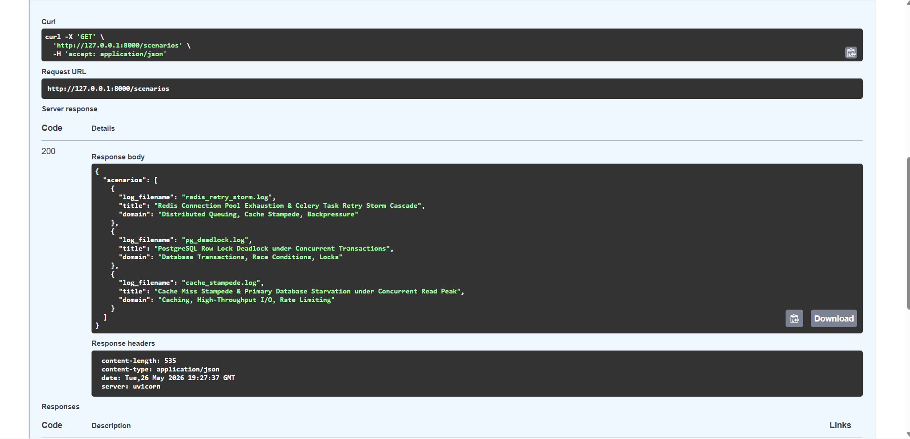
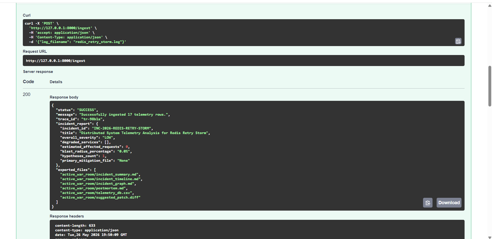

# Aegis — AI-Native Incident Correlation & Observability Platform

> **Deterministic telemetry correlation engine + Groq LLaMA 3.3 70B live RCA — built for distributed systems incident debugging.**

[](https://python.org)
[](https://fastapi.tiangolo.com)
[](https://docs.pydantic.dev)
[](https://groq.com)
[](LICENSE)

---

## ⚡ Quick Start

```bash
git clone https://github.com/AshrafAhmed9/aegis-observability.git
cd aegis-observability\backend

# Copy the env template and add your free Groq key (or skip — offline mode works without it)
copy .env.example .env

# Install dependencies and start the server
.\run.bat
```

Open `http://127.0.0.1:8000/docs` — then hit `POST /ingest` with `{"log_filename": "redis_retry_storm.log"}`.

---

## 🎬 Demo


---

## 📸 Screenshots

### Jetro Incident War Room


### Failure Propagation Graph


### API — `/scenarios` Endpoint


### API — `/ingest` Endpoint (Live AI RCA)


---

## 🧠 Problem Statement

Modern distributed systems fail in complex, cascading ways. A single Redis pool exhaustion event can silently propagate through Celery workers, trigger exponential retry storms, exhaust thread pools, and ultimately crash customer-facing checkout endpoints — all within seconds.

Traditional observability approaches force engineers to:
- Manually correlate thousands of unstructured log lines
- Context-switch between Grafana, Kibana, PagerDuty, and Slack
- Reconstruct failure chains mentally under incident pressure
- Write postmortems from memory hours after resolution

**Aegis solves this by treating incident correlation as a deterministic graph problem first, and an AI interpretation problem second.**

---

## 🏗️ System Architecture & Telemetry Pipeline

```text
       +---------------------------------------------+
       |           Raw Unstructured Logs             |
       +---------------------------------------------+
                              │
                              ▼
       +---------------------------------------------+
       |          Structured Parsing Layer           |
       |  (Regex Key-Value & Trace Token Extraction)  |
       +---------------------------------------------+
                              │
                              ▼
       +---------------------------------------------+
       |      Telemetry Correlation Engine           |
       |  (Deterministic trace/span grouping)        |
       +---------------------------------------------+
                              │
                              ▼
       +---------------------------------------------+
       |       Dependency Graph Construction         |
       |  (Failure Propagation & Blast Radius Calc)  |
       +---------------------------------------------+
                              │
                              ▼  [Operational Trust Boundary]
       + - - - - - - - - - - - - - - - - - - - - - - +
       :       Groq LLaMA 3.3 70B AI RCA Layer       :
       :  (Pydantic Structured Diagnostic Synthesis) :
       + - - - - - - - - - - - - - - - - - - - - - - +
                              │
                              ▼
       +---------------------------------------------+
       |        Jetro Spatial Whiteboard Cockpit     |
       |  (Markdown RCA, Flowcharts, CSV, Diffs)     |
       +---------------------------------------------+
```

---

## 🔒 Operational Trust Boundary

This is the core architectural principle of Aegis.

Most "AI observability" tools pass raw logs directly to an LLM and ask it to explain what went wrong. This approach is **fundamentally unreliable** because:

- LLMs hallucinate causal relationships that don't exist in the data
- Raw logs lack the structural context needed for accurate reasoning
- There is no ground truth to validate the AI's conclusions against

**Aegis enforces a strict separation:**

| Layer | Responsibility | Trust Level |
| :--- | :--- | :--- |
| Deterministic Engine | Trace correlation, span grouping, graph construction, blast radius | **Ground truth** |
| AI Augmentation Layer | Hypothesis ranking, natural language synthesis, patch generation | **Interpretive only** |

The AI never sees raw logs. It receives a structured, pre-correlated graph — the mathematical output of the deterministic engine. This means every AI hypothesis is grounded in verified telemetry data, not pattern-matched guesswork.

---

## 🛠️ Technical Specifications

### Ingestion & Parsing
Aegis parses structured logs carrying rich distributed trace metadata:

| Field | Description |
| :--- | :--- |
| `trace_id` | Hexadecimal transaction tracker — links all events in a request chain |
| `span_id` / `parent_span_id` | Parent-child call graph relationships |
| `service_name` | Executing microservice identifier |
| `latency_ms` | Database and cache operation duration |
| `connection_pool_usage` | Active connection utilization percentage |
| `queue_depth` | Task backlog depth for queue pressure modeling |

Example log line:
```text
2026-05-28T11:42:13Z service=celery-worker trace_id=tr-98b24 span_id=sp-017
queue_depth=842 retry_count=9 connection_pool_usage=100% severity=CRITICAL
msg="Celery thread pool starvation. Worker thread limits reached. Crash loop initiated."
```

### Telemetry Correlation Engine
- Groups events by shared `trace_id` into transaction chains
- Resolves `parent_span_id` relationships to construct directed call graphs
- Ranks services by maximum observed severity
- Calculates blast radius from degraded service count and request rate
- Correlates 48+ telemetry events across 5 microservices into a unified dependency graph in under 2 seconds locally

### Groq AI RCA Engine
- Receives pre-correlated graph (NOT raw logs) as structured input
- Returns `AegisDiagnosticReport` — a Pydantic v2 validated schema
- Produces ranked hypotheses with confidence scores (0.0–1.0)
- Synthesizes unified git diff patches targeting specific source files
- Generates SRE-grade postmortem with prevention action items
- Graceful fallback to pre-packaged offline diagnostics on API failure

---

## 💻 War Room Artifacts

Every `/ingest` call overwrites `active_war_room/` with 6 fresh artifacts:

| File | Format | Contents |
| :--- | :--- | :--- |
| `incident_summary.md` | Markdown | RCA hypotheses, severity, blast radius |
| `incident_timeline.md` | Markdown table | Chronological trace event timeline |
| `incident_graph.md` | Mermaid flowchart | Color-coded failure propagation graph |
| `postmortem.md` | Markdown | SRE postmortem with prevention checklist |
| `telemetry_db.csv` | CSV | SQL-queryable trace database |
| `suggested_patch.diff` | Unified diff | Ready-to-review code remediation |

---

## 🎯 Production Failure Scenarios

| Scenario | Log File | Failure Chain |
| :--- | :--- | :--- |
| Redis Pool Exhaustion + Retry Storm | `redis_retry_storm.log` | Pool saturation → Celery timeouts → exponential retries → thread starvation → HTTP 504 |
| PostgreSQL Row Lock Deadlock | `pg_deadlock.log` | Non-deterministic lock ordering → circular wait → transaction rollback → HTTP 500 |
| Cache Stampede + DB Starvation | `cache_stampede.log` | Rate limiter bypass → cache miss flood → connection pool exhaustion → HTTP 503 |

---

## ⚖️ Design Tradeoffs

### Why deterministic correlation before AI?
LLMs are excellent at synthesis and natural language generation but unreliable as the primary source of truth for causal reasoning over telemetry data. By running deterministic correlation first, we guarantee that every AI output is anchored to verified graph data — eliminating hallucinated failure chains.

### Why trace IDs as the correlation primitive?
Trace IDs are the standard distributed tracing primitive (W3C TraceContext spec, OpenTelemetry). They are propagated across service boundaries at the network level, making them the most reliable signal for grouping causally-related events — more reliable than timestamp proximity or service name matching.

### Why local CSV over a distributed time-series database?
For an incident debugging workflow, the bottleneck is human comprehension, not query performance. A local CSV queryable via DuckDB/SQL gives engineers immediate, familiar access to raw telemetry without infrastructure overhead. A Prometheus/ClickHouse backend would add operational complexity without improving the core debugging workflow.

### Why Mermaid over D3?
Mermaid graphs are text-defined, version-controllable, and render natively in GitHub, Notion, and Jetro. A D3 graph would require a frontend runtime and custom rendering logic for no meaningful gain in this use case.

### Why FastAPI?
Pydantic v2 is a first-class FastAPI citizen. Since the entire diagnostic pipeline is built around Pydantic schemas, FastAPI eliminates the impedance mismatch between the data model and the HTTP layer.

---

## 🌐 Why Jetro?

Incident debugging is inherently collaborative and spatial. Engineers rarely work through a single log file in isolation — they need timelines, dependency graphs, raw telemetry, and remediation patches simultaneously visible in the same workspace.

Jetro enables this by treating every generated artifact as a first-class canvas element:

- **Timelines and graphs coexist visually** — no tab-switching between Kibana, Grafana, and Slack
- **AI-generated hypotheses sit beside raw telemetry** — engineers can validate AI reasoning against ground truth instantly
- **War room is persistent** — the canvas survives page reloads and can be shared across the team
- **SQL queries run inline** — `telemetry_db.csv` is queryable directly on the canvas without leaving the workspace

This is the core workflow thesis: incident investigation should feel like a spatial reasoning exercise, not a terminal archaeology dig.

---

## 🔭 Future Work

- **OpenTelemetry ingestion** — accept OTLP spans directly from instrumented services
- **Multi-trace correlation** — correlate incidents spanning multiple trace IDs via shared resource identifiers
- **Prometheus alert integration** — trigger ingest automatically from alertmanager webhooks
- **Vector similarity search** — match new incidents against historical postmortem embeddings
- **Live log streaming** — WebSocket endpoint for real-time war room updates during active incidents
- **Slack/PagerDuty export** — push incident summaries to on-call channels automatically

---

## ⚠️ Known Limitations

- **Synthetic telemetry only** — sample logs are pre-authored scenarios, not ingested from live instrumented services
- **Single-trace correlation** — the engine correlates one primary trace ID per ingest; incidents spanning multiple traces are not yet linked
- **Local CSV storage** — telemetry is not persisted to a time-series database; `active_war_room/` is overwritten on every ingest
- **No real-time streaming** — ingest is request-triggered, not event-driven from a log stream
- **No persistent state** — the server is stateless; incident history is not retained between runs

Acknowledging these is intentional. Aegis is an incident debugging workflow prototype, not a production observability platform replacement.

---

## 🚀 Running Locally

### Option 1: Docker (recommended)

```bash
# Clone the repo
git clone https://github.com/AshrafAhmed9/aegis-observability.git
cd aegis-observability

# Create backend/.env and add your Groq API key (get one free at console.groq.com)
# Windows: create the file in any text editor
# Mac/Linux: echo "GROQ_API_KEY=your_key_here" > backend/.env

# Start
docker compose up
```

### Option 2: Direct (Windows)

```bash
# Clone the repo
git clone https://github.com/AshrafAhmed9/aegis-observability.git
cd aegis-observability\backend

# Create a .env file in the backend/ folder with your Groq API key:
# GROQ_API_KEY=your_key_here

.\run.bat
```

> **Note:** A Groq API key is free at [console.groq.com](https://console.groq.com). Without it, Aegis automatically falls back to pre-packaged offline diagnostics — no key required to run.

Open `http://127.0.0.1:8000/docs` for the Swagger UI.

### Test the pipeline

```bash
# List scenarios
curl http://127.0.0.1:8000/scenarios

# Ingest and generate AI RCA
curl -X POST http://127.0.0.1:8000/ingest \
  -H "Content-Type: application/json" \
  -d '{"log_filename": "redis_retry_storm.log"}'
```

> A free Groq API key is available at [console.groq.com](https://console.groq.com). Without it, Aegis falls back to pre-packaged offline diagnostics automatically.

---

## 📁 Project Structure

```
aegis-observability/
├── app/
│   ├── main.py              # FastAPI endpoints (/ingest, /scenarios)
│   ├── parser.py            # Structured KV trace log parser
│   ├── correlation.py       # Deterministic trace correlation & graph builder
│   ├── analyzer.py          # Groq AI RCA engine with Pydantic v2 schemas
│   └── jetro_service.py     # War room artifact exporter
├── sample_logs/
│   ├── redis_retry_storm.log
│   ├── pg_deadlock.log
│   └── cache_stampede.log
├── active_war_room/         # Auto-generated on every /ingest call
├── screenshots/
├── Dockerfile
├── docker-compose.yml
├── implementation_plan.md
└── README.md
```

---

## 🎤 Interview Reference

**Q: Why not just pass logs to GPT?**
Raw logs lack causal structure. LLMs pattern-match on log text and frequently hallucinate failure chains. The deterministic engine establishes mathematical ground truth first — the AI only interprets the pre-verified graph.

**Q: What is a trace ID and why does it matter?**
A trace ID is a unique token injected at the request entry point and propagated across every downstream service call. It is the only reliable primitive for grouping causally-related events across a distributed system.

**Q: What is blast radius?**
A quantitative estimate of how many user-facing requests were degraded by the incident, calculated from the number of affected service nodes, their position in the dependency graph, and observed request rates.

**Q: Why confidence-weighted hypotheses instead of a single root cause?**
In distributed systems, incidents rarely have exactly one cause. A thundering herd is simultaneously a pool exhaustion problem AND a retry misconfiguration. Confidence weighting reflects the probabilistic nature of incident causality and prevents premature diagnostic closure.
