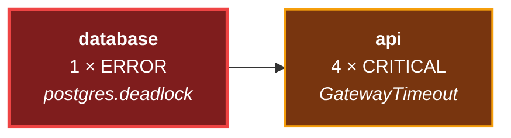
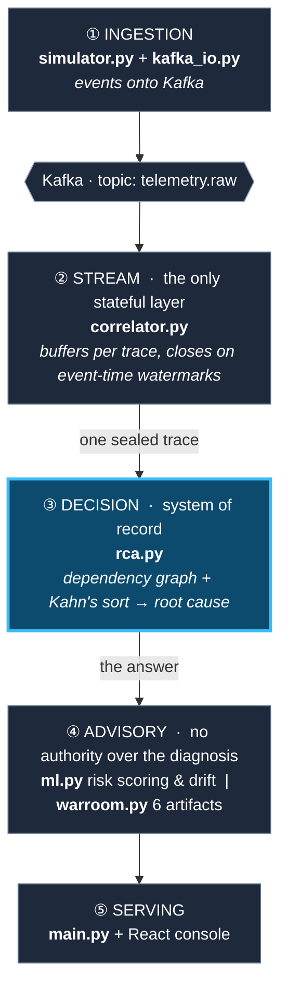

# Aegis — AI-Native Incident Correlation & Observability Platform

> **Streaming telemetry correlation engine with event-time watermarks, topological root-cause analysis, a self-training ML lifecycle, and LLM-augmented diagnostics for distributed systems.**

[](https://python.org)
[](https://fastapi.tiangolo.com)
[](https://react.dev)
[](https://scikit-learn.org)
[](https://kafka.apache.org)
[](https://prometheus.io)
[](https://grafana.com)
[]()
[](https://github.com/AshrafAhmed9/aegis-observability/actions/workflows/ci.yml)
[](LICENSE)

---

## The problem

When a distributed system breaks, the service making the most noise is usually not the one that
broke.

A database deadlocks. The API in front of it starts timing out and floods your alerts with
CRITICAL errors, because it's the one facing users. The database logs a single line and goes
quiet. At 3am, an on-call engineer is staring at hundreds of errors from a service that is
working fine, trying to work out which of the screaming things actually started it.

Aegis answers that question automatically.

## The core idea

Root-cause analysis is treated as a **graph problem, not a scoring problem**.

Log lines aren't independent. When one service calls another, the downstream span records the
identity of the request that triggered it. That's standard distributed tracing, modelled exactly
as OpenTelemetry does it. Follow every one of those parent pointers and a pile of alerts becomes
a directed graph of what caused what.

On that graph, "which one started it" has an exact answer: **the node with no incoming edges.**



`api` is louder by 4× and it is the *effect*. `database` has nothing pointing at it, so it's the
cause. A topological sort (Kahn's algorithm) generalises this to arbitrarily deep dependency
chains, and it's **correct on all 78 incidents in the evaluation set**.

Everything else in the project exists to build that graph, read it, or explain what it found.

## Why the AI doesn't decide anything

There is a gradient-boosting model here and a large language model, and **neither is permitted
to choose the root cause.** The graph chooses it.

- The **ML model** runs in shadow mode, predicting which service is about to fail. Its scores
  are recorded and evaluated, never acted upon.
- The **LLM** is handed the root cause the graph already found and asked to write it up
  readably. It narrates a decision; it doesn't make one.

That boundary is deliberate. The deterministic engine is verifiable against known ground truth,
78 times out of 78. The models are not. Information flows *into* the advisory layer and never
back out into the decision, so the worst either model can do is be unhelpful. If the LLM is
unreachable, the diagnosis is identical and only the prose gets plainer.

---

## Architecture

Five layers. An event enters at the top and moves straight down; nothing skips a layer and
nothing flows back up.



Two files sit outside this flow because they never run during a request: `train.py` produces the
model, and `run_eval.py` grades the pipeline.

### How each layer works

**Ingestion.** `simulator.py` generates fault episodes for a four-service fleet: a cache leak, a
queue backlog, and a database deadlock burst. Each episode has a known culprit, a realistic retry
backoff before failure, and a cascade whose spans point back at the original error. Swapping this
for a real OTLP collector would change nothing downstream, since the event shape is already the
OpenTelemetry span model.

**Stream.** Events arrive out of order and nothing ever signals that a trace is complete.
`correlator.py` buffers them per `trace_id` and closes a trace on an **event-time watermark**,
the newest timestamp seen minus a grace period, so network delays can't change the analysis. A
max-age rule bounds memory, and a wall-clock idle rule handles the case where no further traffic
exists to advance the watermark.

**Decision.** `rca.py` builds one node per service and one edge per `parent_span_id` crossing a
service boundary, then runs Kahn's algorithm over the failed services. It handles the awkward
cases explicitly: services in a dependency cycle can't be ordered, so all of them are reported as
causes, and failures with no causal edge between them fall back to earliest-error ordering, which
is the weaker path and is labelled as such.

**Advisory.** `ml.py` reduces each event to four features. The dominant one is how long a
service has been silent: a healthy one checks in every five seconds, a struggling one goes quiet.
Features come only from prior events, so no future information leaks into training. A PSI drift
monitor over a rolling window reports whether live traffic still resembles what the model learned
from. `warroom.py` writes six artifacts per incident: summary, timeline, Mermaid dependency
graph, postmortem, raw telemetry CSV, and a suggested patch.

**Serving.** `main.py` exposes the API and runs two background tasks: the Kafka consumer, and a
loop that closes traces gone quiet in real time. The React console polls for incidents and live
shadow predictions.

---

## Results

Every number below is recomputed from scratch on each run, and re-verified by CI on every push.

| Metric | Result | How it's measured |
|---|---|---|
| Root-cause accuracy | **78 / 78** | 26 episodes × 3 fault types, run blind through the real pipeline |
| Median early warning | **193.4s** | First high-risk prediction → actual failure, across 18 held-out episodes |
| Prediction recall | **18 / 18** | Held-out episodes where the model raised an alarm before failure |
| Test suite | **69 passing** | Correlation, RCA, prediction, drift, simulation |

```bash
cd backend
python train.py      # trains the model, prints the measured lead time
python run_eval.py   # grades the correlation engine, writes scorecard.md
```

`run_eval.py` regenerates all 78 episodes, feeds each through an actual `Correlator` and
`rca.analyze`, the same classes that serve live traffic rather than a test double, then compares
the predicted root cause against the injected one. Misses are written to `scorecard.md` with
their seeds, so any failure reproduces exactly.

**On the benchmark being synthetic:** it is, deliberately, and that's what makes the number
meaningful. Real production logs carry no ground truth, so an engine pointed at them can't be
scored at all. Generating the faults means the correct answer is known before the engine sees the
data. This validates the correlation and ranking logic; it does not claim to have survived the
mess of real production telemetry.

---

## Quick start

```bash
git clone https://github.com/AshrafAhmed9/aegis-observability.git
cd aegis-observability/backend

python -m venv .venv && source .venv/bin/activate
pip install -r requirements.txt
cp .env.example .env   # optional: without a Groq key, reports fall back to deterministic
python train.py
uvicorn main:app --port 8010
```

Frontend, in a second terminal:

```bash
cd frontend && npm install && npm run dev
```

Click a fault button to inject a failure and watch it resolve into an incident. Once dependencies
are installed, **`./demo.sh`** does all of the above in one command: infrastructure, both
servers, and an injected fault so the console isn't empty.

### Full stack

```bash
docker-compose up kafka prometheus grafana
```

| Service | URL |
|---|---|
| API | http://127.0.0.1:8010 |
| API docs | http://127.0.0.1:8010/docs |
| Prometheus | http://localhost:9091 |
| Grafana | http://localhost:3000 (admin / aegis) |

---

## Project layout

```
backend/
  simulator.py       synthetic fault episodes (demo traffic + eval data)
  correlator.py      event-time watermark buffering
  rca.py             dependency graph + Kahn's topological sort
  ml.py              feature extraction, GBM shadow detector, PSI drift
  warroom.py         6-artifact incident reports (Groq + fallback)
  kafka_io.py        Kafka producer/consumer
  main.py            FastAPI app, background tasks, Prometheus metrics
  train.py           trains the model on simulator-generated data
  run_eval.py        78-episode correctness + lead-time evaluation
  tests/             69 tests
  observability/     Prometheus + Grafana provisioning
frontend/
  src/App.jsx        single-page console
```

```bash
cd backend && pytest      # 69 tests, runs in about a second
```

Tests are fast because event timestamps are plain numbers rather than wall-clock time. A test
for a 320-second closing rule doesn't wait 320 seconds.

## License

MIT
