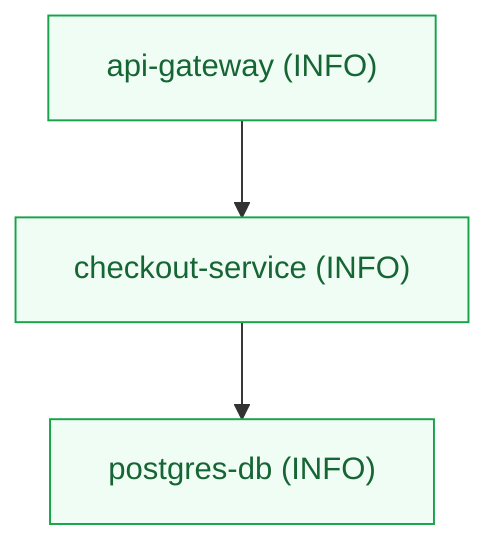

# 🕸️ Failure Propagation Graph

This flowchart visualizes how cascading database latencies and lock contentions propagated through downstream service nodes to cause the system-wide gateway meltdown:

> [!TIP]
> Red boxes indicate failed or severely degraded service components. Connective arrow tags trace the propagation vector and error classes that traversed network layers.